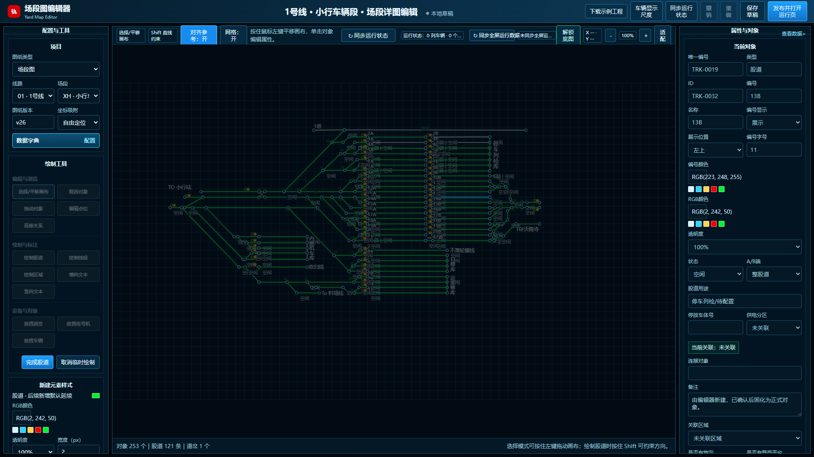
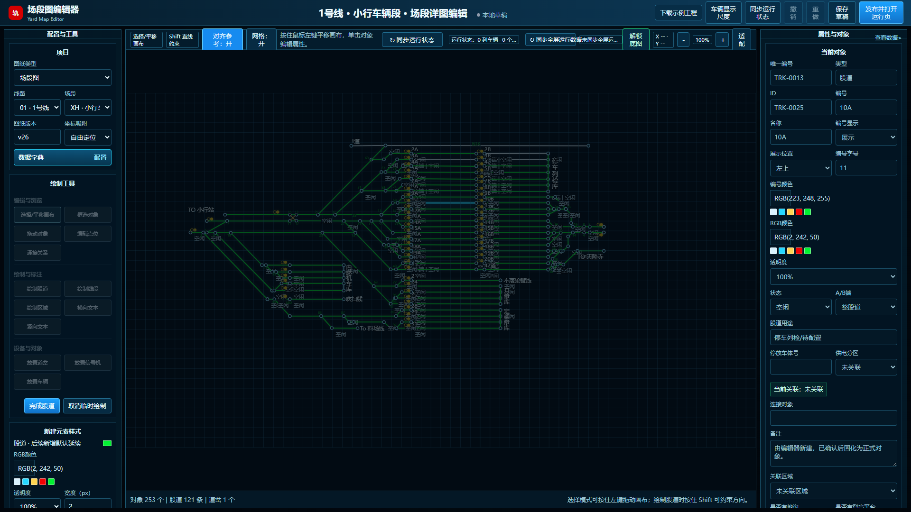
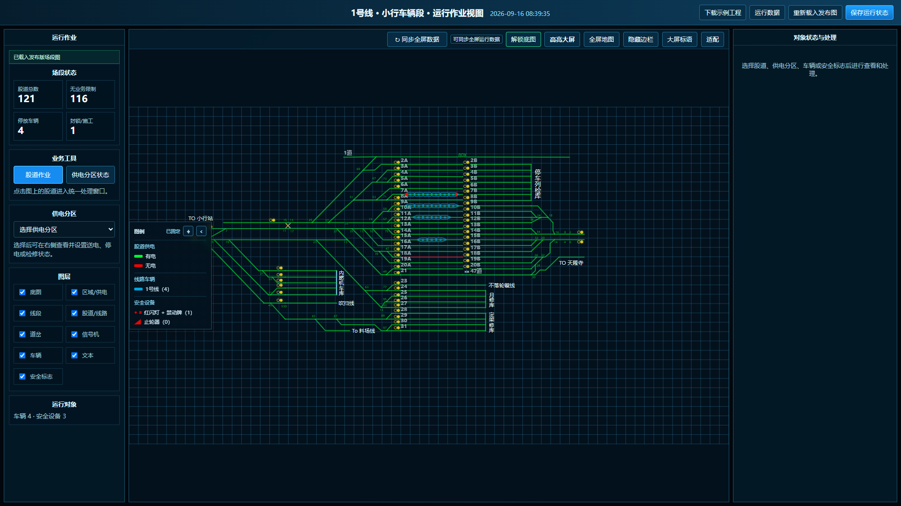
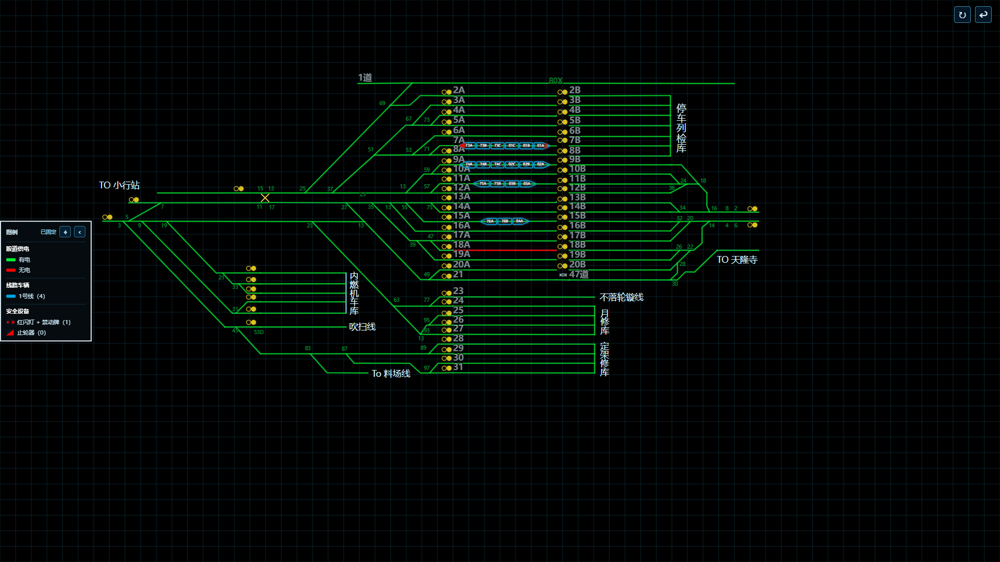

# 场段图编辑器

面向车辆段、停车场及库内作业场景的浏览器端场段平面图编辑工具。它用于把 PDF 或图片底图上的股道、供电分区、道岔、信号机、文本等基础要素配置成可交互的电子地图，并提供运行作业页，用于标记股道供电状态、停放车辆和安全防护设备。

> 本仓库是公开示例版，不包含任何真实线路、场段图纸、运行数据、账号口令或运营规章资料。

## 在线使用

GitHub Pages 发布后，可直接通过仓库的 Pages 地址访问，无需安装服务端。页面中的工程数据默认保存在当前浏览器；重要工程请使用“导出 JSON”备份。

## 成果截图

以下画面展示同一场段工程从编辑、属性维护、运行标记到全屏展示的使用链路。画面中的车辆、安全设备和状态均为展示用途，不代表现场实时数据。

### 1. 场段图编辑



### 2. 股道属性维护



### 3. 运行作业标记



### 4. 全屏大屏展示



## 能做什么

- 导入 PDF、图片或 SVG 作为参考底图；底图只在当前浏览器中使用，不会写入导出的 JSON。
- 绘制和维护股道、区域或供电分区、道岔、信号机、线段、横向或竖向文本及图面车辆。
- 使用图层控制底图、区域、线路、股道、道岔、信号机、车辆和文本的显示。
- 配置线路、场段、车辆类型、编组和安全防护设备等基础字典。
- 在运行作业页按股道设置有电或无电、空闲、封锁、施工等信息，放置电客车、工程车及止轮器、红闪灯、禁动牌。
- 以新浏览器页签打开全屏大屏图；编辑页、运行页和全屏页使用浏览器本地数据同步。
- 导入或导出 JSON 工程，便于项目交接、备份和继续配置。

## 快速开始

1. 打开在线页面，或下载本仓库后直接打开 `index.html`。
2. 点击“下载示例工程”，再在编辑页选择“导入 JSON”，可以快速查看一个不含真实业务数据的示例。
3. 使用“导入 PDF/图片”载入参考底图，按需缩放、平移和隐藏底图。
4. 用“绘制股道”“绘制区域”“放置道岔”“放置信号机”等工具配置基础图。
5. 点击“发布并打开运行页”，在运行页对股道、车辆和安全设备做值班标记。
6. 通过“导出 JSON”保存工程。再次使用时先导入 JSON，再重新导入原始底图即可。

## JSON 数据边界

导出工程包含：场段基础对象、数据字典、图层与样式配置、股道关联关系和运行状态。

导出工程不包含：PDF、图片或 SVG 底图的文件内容；用户需要自行保留原始底图，并在重新打开工程后再次导入。

公开示例版只接受场段工程 JSON。包含正线工程的旧版综合 JSON 会优先读取其中的 `yard` 场段部分，不会进入正线功能。

## 使用边界

- 这是纯浏览器工具，不含服务端、账号权限、多人协同或正式接口接入能力。
- 运行数据只保存在当前浏览器。清理浏览器站点数据、使用无痕模式或更换设备后，本地数据不会自动保留。
- 生产部署前应增加后端存储、账号和权限、审计记录、接口鉴权、数据校验和运行监控。

## 本地开发

本项目没有构建步骤。修改 `index.html` 后，用现代浏览器直接打开即可；如需验证 PDF 底图和页面间数据同步，建议通过本地 HTTP 服务打开。

```powershell
cd subway-depot-dsiplay-screen-editor
python -m http.server 8080
```

然后访问 `http://localhost:8080/`。

## 发布 GitHub Pages

仓库已经包含 GitHub Pages 工作流。将变更合并到 `main` 分支后，在 GitHub 仓库的 `Settings -> Pages` 中将 Source 设为 `GitHub Actions`。首次工作流完成后，Pages 地址会显示在该页面。

## 许可证

本项目采用 [MIT License](LICENSE)。在实际项目中使用时，请自行确认底图、规章、图纸、标志和运行数据的授权范围。
